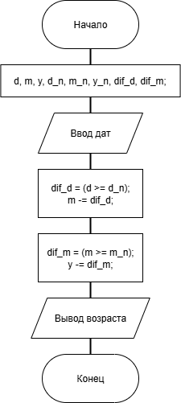

# Домашнее задание к работе 3

### Условие:
Написать и отладить программу вычисления возраста по дате рождения.

### Алгоритм:
1. Начало      
2. Объявить переменные;        
	`int day, month, year;`  
	 `int day_now, month_now, year_now;`   
3. Считать данные даты рождения пользователя, а также сегодняшней даты;      
	`scanf("%d", &day);`    
	 `...`   
4. Выполнить подсчёт возраста логическими операциями;  
	`difference_d = (day >= day_now);`  
	`month_now -= difference_d;`  
    `...`  
5. Выввести результат пользователю;  
    `printf("\nВаш возраст - %d лет.\n", year_now - year);`  
5. Конец.    

### Блок-схема:

## 2. Реализация программы 

#include <locale.h>
#define _CRT_SECURE_NO_DEPRECATE
#include <stdio.h>

int main()
{
	setlocale(LC_ALL, "RUS");

	int day, month, year; // переменные для даты др пользователя
	int day_now, month_now, year_now; // переменные для сегодняшней даты
	int difference_d = 0, difference_m = 0;
	// считывание даты рождения
	puts("Введите день Вышего рождения, например, 1 (что значит первый день месяца)");
	scanf("%d", &day);
	puts("Введите месяц Вашего рождения, например, 3 (что значит март)");
	scanf("%d", &month);
	puts("Введите год Вашего рождения");
	scanf("%d", &year);

	// считывание сегодняшней даты
	puts("Введите сегодняшний день");
	scanf("%d", &day_now);
	puts("Введите сегодняшний месяц");
	scanf("%d", &month_now);
	puts("Введите сегодняшний год");
	scanf("%d", &year_now);

	// проверка, если вдруг день и месяц рождения численно больше сегодняшних дня и месяца

	difference_d = (day >= day_now);			// Аналог действий слева, но используя условие
	month_now -= difference_d;					//if (day >= day_now) month_now--;
												//if (month >= month_now) year_now--;
	difference_m = (month >= month_now);		//if (month >= month_now) year_now--;
	year_now -= difference_m;					

	//вывод рез-та
	printf("\nВаш возраст - %d лет.\n", year_now - year);

	return 0;
}

## 3. Результаты работы программы

Введите день Вышего рождения, например, 1 (что значит первый день месяца)  
1  
Введите месяц Вашего рождения, например, 3 (что значит март)  
5  
Введите год Вашего рождения  
2005  
Введите сегодняшний день  
23  
Введите сегодняшний месяц  
9  
Введите сегодняшний год  
2025  
  
Ваш возраст - 20 лет.  